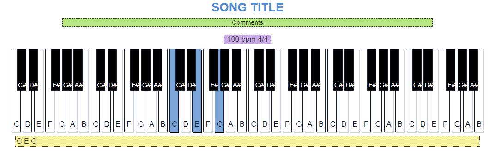

# Piano Chords & Scales
Piano Chords and Scales

> Based in the repo: [Boateng24/Piano-Keys](https://github.com/Boateng24/Piano-Keys)

HTML page to draw the keys of a Piano, giving you the possibility to highlight the keys that you are going to use

This repo does not contain all the chords and scales

Is a repo to help you how to do it!

You can use this repo to prepare your own songs too



## HTML & CSS

The HTML page, has a CSS that could be changed easily

> Note: The code I am sharing here, is not an HTML responsive

## How to highlight a key

To highlight a key, you should add *selected* in the class section

For example, the original section:

```html
<section id='c3-c-key' class='key'>
    <section class='keynote'>C</section>
</section>
```

Should be modified as:

```html
<section id='c3-c-key' class='key selected'>
    <section class='keynote'>C</section>
</section>
```
